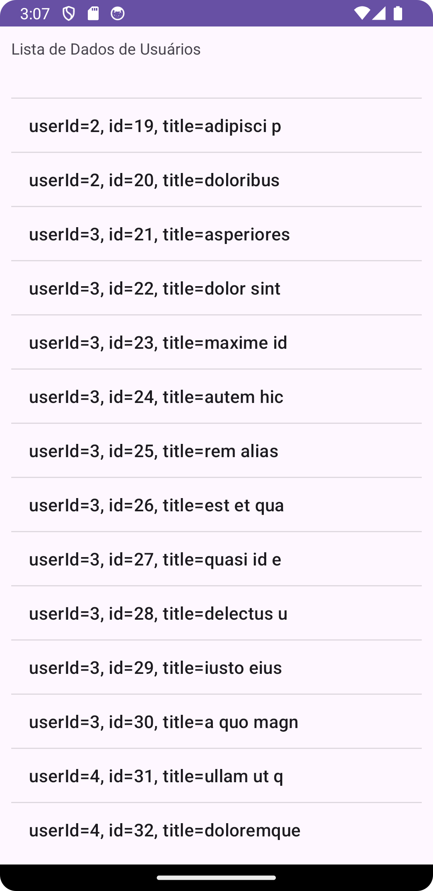

## APP - 06022024 - JSON HTTP
| Resumo                                                                                                                                                                                                                     | Resultado                           |
|----------------------------------------------------------------------------------------------------------------------------------------------------------------------------------------------------------------------------|-------------------------------------|
| Criado em sala de aula para demonstrar como se consome uma API e recupera o recurso JSON.  Também foi feito a transformação do JSON em Objeto Java.  Feito com AsynkTask.  Uso da Biblioteca GSON. |  |

## AT - 06022024 - JSON HTTP
| Resumo                                                                                                                                                                                                                  | Resultado                           |
|-------------------------------------------------------------------------------------------------------------------------------------------------------------------------------------------------------------------------|-------------------------------------|
| Atividade onde os alunos devem alterar o código feito em sala para se adequar aos novos padrões.  Não deve ser usado AsynkTask.  Foi usado o Recurso Android Executor.  Uso da Biblioteca GSON. |  |

## Fontes
https://apag-guimaraes.github.io/programacao_dispositivos_moveis_dois/aula_dois/
https://stackoverflow.com/questions/58767733/the-asynctask-api-is-deprecated-in-android-11-what-are-the-alternatives
https://developer.android.com/reference/java/util/concurrent/Executor
https://jsonplaceholder.typicode.com/posts/
http://www.jsonschema2pojo.org/
