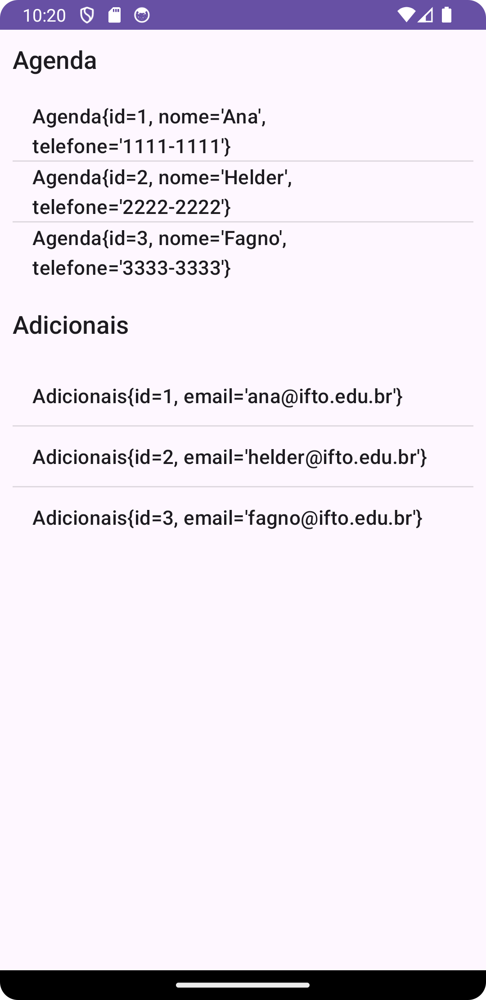

## APP - 20240220 - JSON SERVER + ROOM
| Resumo                                                                                                                                                                                                                                                                                                               | Resultado                           |
|----------------------------------------------------------------------------------------------------------------------------------------------------------------------------------------------------------------------------------------------------------------------------------------------------------------------|-------------------------------------|
| Criado em sala de aula para demonstrar como se consome uma API e recupera o recurso JSON.  Persistência dos dados carregados em banco de dados SQLite com a Biblioteca Room  Também foi feito a transformação do JSON em Objeto Java.  Feito com AsynkTask.  Uso da Biblioteca GSON. |  |